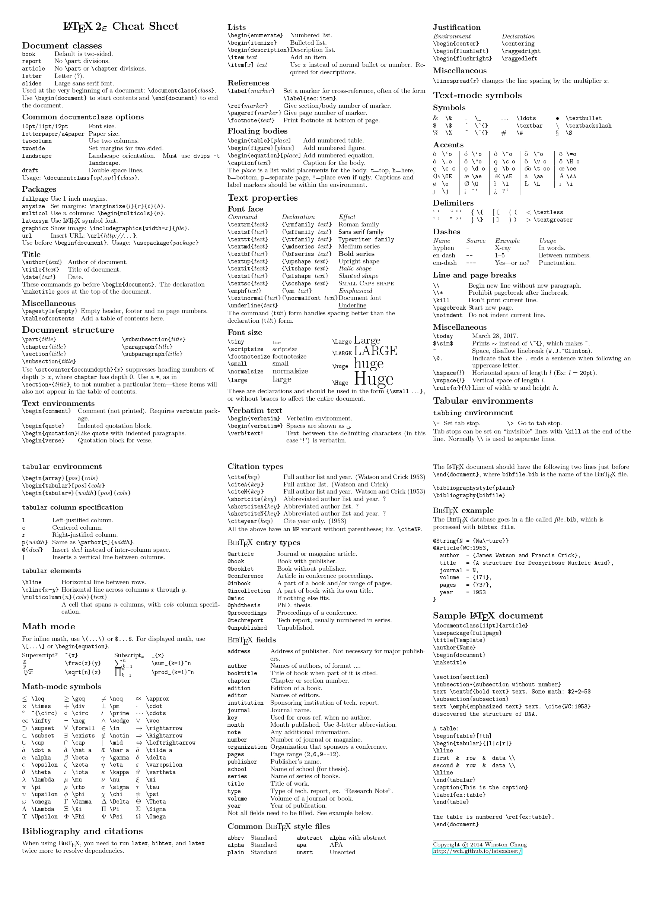
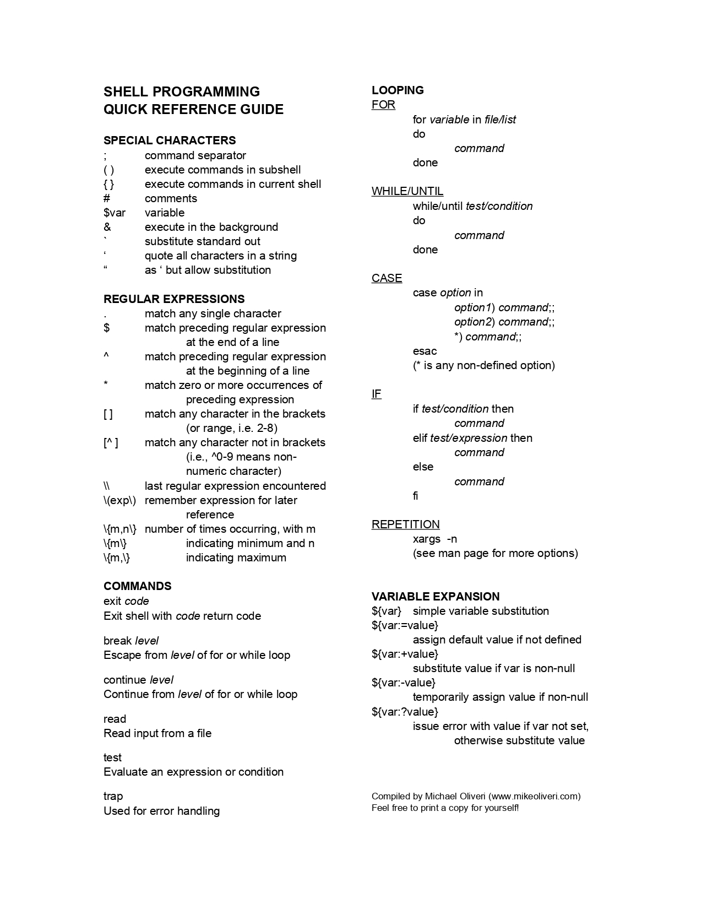
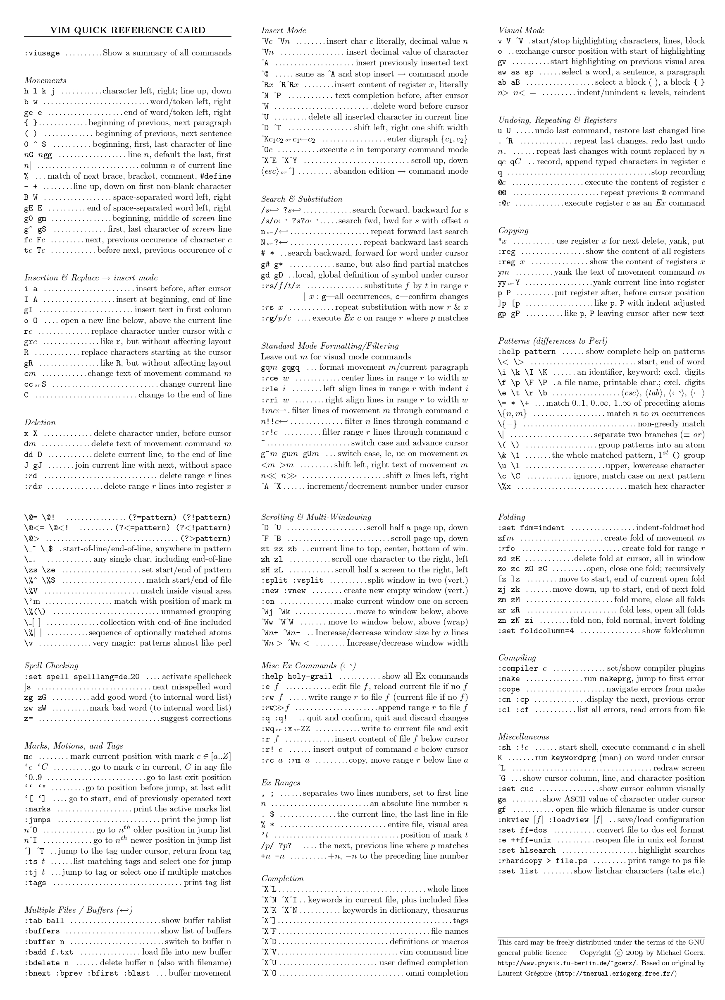

Here is the list of useful tools and cheatsheet by SDK. This list will be updated regularly.

## Useful Tools Links
- [Fast & Simple Screen Sharing](https://screensy.marijn.it/)
- [Fast & Simple File Sharing Over LAN](https://www.sharedrop.io/)
- [Fast & Simple File Sharing Over Internet](https://tmpfiles.org/)
- [CLI Sharing tool](http://0x0.st/)
- [Pup - Web Scraping Tool](https://github.com/ericchiang/pup)
- [Simple Drawing Board](https://excalidraw.com/)
- [Vim Modes Transition Diagram](https://rawgit.com/darcyparker/1886716/raw/vimModeStateDiagram.svg)

## Useful Cheatsheets Links
- [Overapi Docs](https://overapi.com/)
- [JavaScript](https://overapi.com/javascript)
- [NodeJs](https://overapi.com/nodejs)
- [Git](https://overapi.com/git)
- [Regex](https://overapi.com/regex)

## Cheatsheets
- Latex Cheatsheet 
- Shell Cheatsheet 
- Vim Cheatsheet 
    
    
