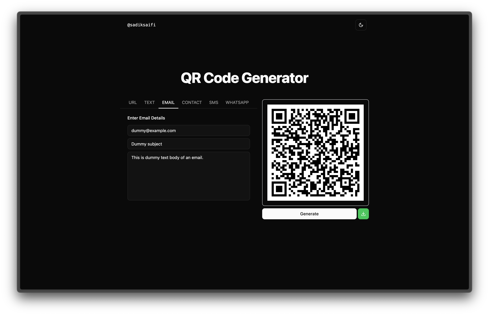

# QR Code Generator

A modern web app to generate QR codes for various data types, including URLs, text, email, contact (vCard), SMS, and WhatsApp. Built with React, TailwindCSS, and TypeScript.

> Visit: [https://qr.sadiksaifi.dev](https://qr.sadiksaifi.dev)



## Features

- Generate QR codes for:
  - URL
  - Text
  - Email (with subject & body)
  - Contact (vCard)
  - SMS
  - WhatsApp
- Download QR codes as SVG
- Responsive and user-friendly UI

## Getting Started

### Prerequisites

- Node.js (v18 or newer recommended)
- pnpm, yarn, or npm

### Install dependencies

```bash
pnpm install
# or
yarn install
# or
npm install
```

### Run the development server

```bash
pnpm dev
# or
yarn dev
# or
npm run dev
```

Open [http://localhost:5173](http://localhost:5173) to view the app in your browser.

## Build for production

```bash
pnpm build
# or
yarn build
# or
npm run build
```

## Lint the code

```bash
pnpm lint
# or
yarn lint
# or
npm run lint
```

## License

This project is licensed under the MIT License. See the [LICENSE](https://github.com/sadiksaifi/monorepo/blob/main/LICENSE) file for details.
